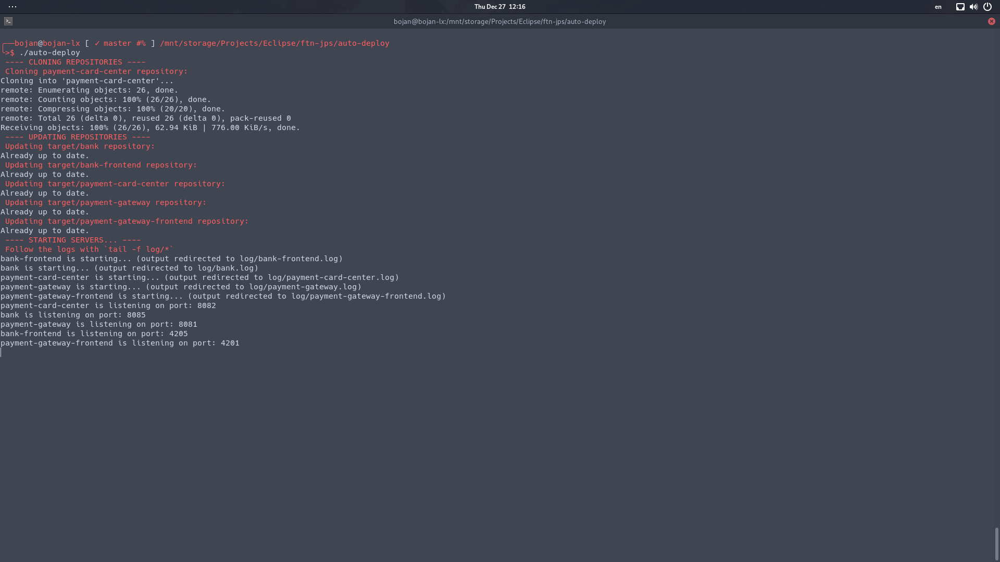

# auto-deploy

Script that automates cloning, updating, and deploying `mvn` and `npm` repositories.



## Prerequisites

```
bash
git
npm
grep
sed
```

## Usage

Run the script, and it will do the rest:
```bash
$ ./auto-deploy
```

Logs are saved to the `log` directory. You can view them with `tail`:
```bash
$ tail -f log/*
```
